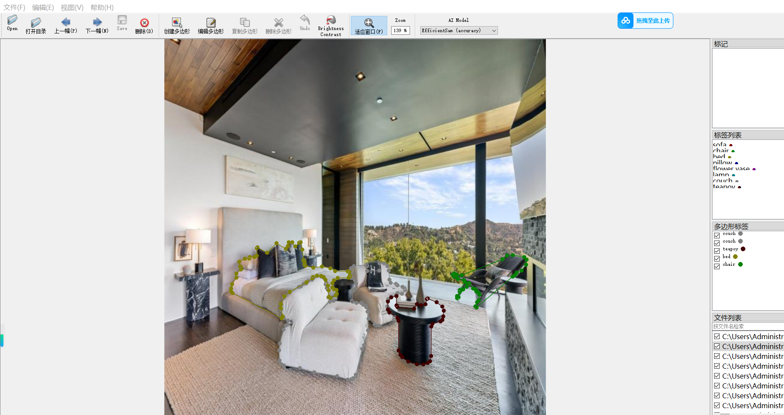
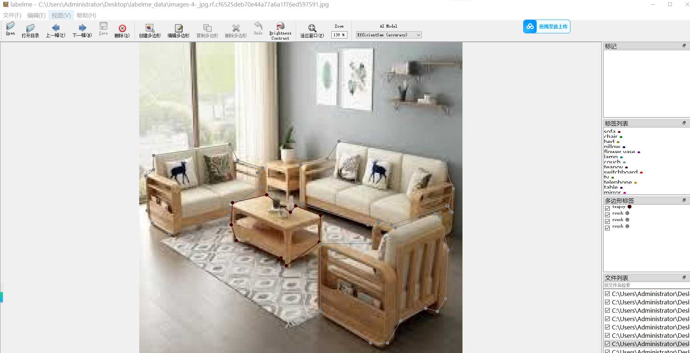
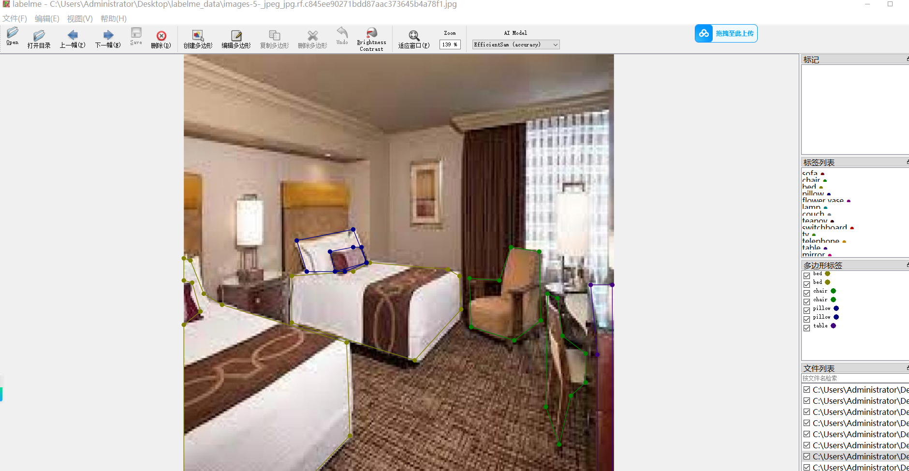
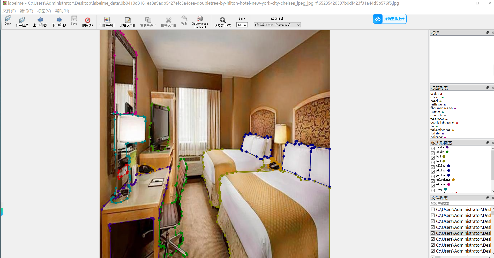

# 15 Types of Furniture Segmentation Dataset: 2943 Images in JSON Format

The 15-type furniture segmentation dataset consists of 2943 images in JSON format.

The dataset follows the labelme format without including a mask file, only containing JPG images and their corresponding JSON files.

The number of images (JPG file count): 2943

The number of annotations (JSON file count): 2943

The number of categories in the annotations: 15

Categories in the annotations: ["chair", "table", "bed", "sofa", "toy", "couch", "tv", "pillow", "lamp", "switchboard", "telephone", "mirror", "flower vase", "remote", "Small ottomans"]

Number of bounding boxes per category:

- Chair count: 1840
- Table count: 835
- Bed count: 1951
- Sofa count: 727
- Toy count: 980
- Couch count: 1634
- TV count: 181
- Pillow count: 1670
- Lamp count: 769
- Switchboard count: 352
- Telephone count: 142
- Mirror count: 93
- Flower vase count: 263
- Remote count: 56
- Small ottomans count: 33

Total bounding box count: 11526

LabelMe version used for annotation: labelme=5.5.0

Repository location: firc-dataset

Image resolution: 640x640

Annotation rules: Polygons are drawn around the categories.

Important note: You can open the dataset using LabelMe to edit it, but the JSON dataset needs to be converted into either a mask or YOLOF format or COCO format for instance segmentation or instance segmentation.

Special notice: This dataset does not guarantee any accuracy in the trained models or weight files.

Annotation and image details are as follows:

## Images

---

Here is a pay link on Stripe (https://buy.stripe.com/3cs8yP7sY87d0vu9AB). Please contact me lonlonago@foxmail.com after funding $89, and I will send you a complete data files, thank you!

